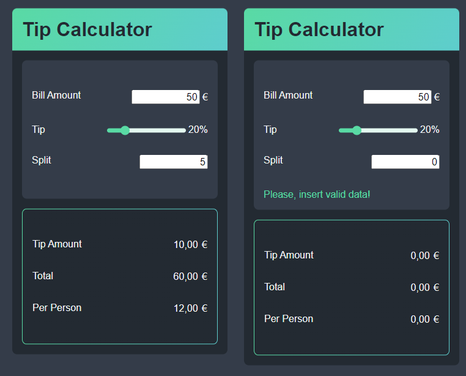

# Tip Calculator
A simple tip calculator with a bill amount field, tip input, and split field. It is a digital tool that helps calculate the appropriate tip to leave for a service.

The bill amount field is where the total amount of the bill is entered, and the tip input is where the percentage of the tip is specified. The split value is where the number of people the bill will be divided among is entered.

Once the necessary information is inputted, the calculator will automatically compute the amount of the tip to be added to the bill and the total amount to be paid, which includes the bill and tip. Additionally, if the split value is provided, the calculator will also determine how much each person will pay.

If some fields in the tip calculator, such as the bill amount box or split box, have no data or contain an invalid value such as zero, an error notification will appear, and the calculator will set the results to default values.

---

